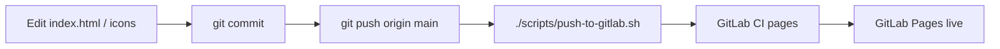

# GitLab la fel ca GitHub — pas cu pas

Pe **GitHub**, agentul poate modifica codul și face `git push` direct. Pe **GitLab**, același lucru e posibil **după o configurare de 5 minute** (token). Apoi fiecare modificare merge la fel: commit → push GitHub → push GitLab → pipeline Pages.

Proiectul tău GitLab (Pages): **`Hercules-metusalem969/hercules-dashboard`**

---

## Pas 1 — Token GitLab (o singură dată)

1. https://gitlab.com → loghează-te ca **Hercules-metusalem969**
2. **Preferences** (avatar) → **Access tokens** → **Add new token**
3. Nume: `cursor-dashboard`
4. Bifează: **write_repository**, **api**
5. **Create** → copiază tokenul (îl vezi o singură dată)

---

## Pas 2 — Spune agentului unde să împingă codul

Alege **una** variantă:

### A) Cursor Cloud Agent (recomandat — ca push pe GitHub)

1. În Cursor: setările proiectului / Cloud Agent → **Secrets** (sau Environment)
2. Adaugă:
   - `GITLAB_TOKEN` = tokenul de la Pas 1
   - `GITLAB_PROJECT` = `Hercules-metusalem969/hercules-dashboard`
3. Repornește agentul sau trimite din nou cererea: *„fă push pe GitLab”*

Agentul rulează:

```bash
chmod +x scripts/push-to-gitlab.sh
./scripts/push-to-gitlab.sh
```

### B) GitHub Actions (sync automat la fiecare push pe `main`)

1. GitHub → repo → **Settings** → **Secrets and variables** → **Actions**
2. **New repository secret:**
   - `GITLAB_TOKEN` = același token
   - `GITLAB_PROJECT` = `Hercules-metusalem969/hercules-dashboard`
3. La fiecare push pe `main`, workflow-ul `.github/workflows/sync-to-gitlab.yml` trimite codul la GitLab.

### C) Mirror Pull în GitLab (fără token în Cursor)

1. GitLab → proiect **hercules-dashboard** → **Settings** → **Repository** → **Mirroring repositories**
2. URL:
   ```
   https://github.com/metusalem969-ro/fhgvbsadujfhgweayiurfgewikugtreiwuqqtqwioarfgvweilugrtiweugbvesdiourtfgewhuiotgferiw.git
   ```
3. Direcție: **Pull** → **Save** → **Update now**

Dacă mirror **Pull** nu e disponibil pe cont, folosește **A** sau **B**.

---

## Pas 3 — Verificare (la fel ca după push pe GitHub)

1. GitLab → **Build** → **Pipelines** → ultimul job **pages** verde
2. **Deploy** → **Pages** → deschide URL-ul
3. Reîncarcă dashboard-ul (sau fereastră privată dacă vezi cache vechi)

---

## Ce trebuie să fie identic pe GitLab după sync

| Pe GitHub (deja făcut) | Unde verifici pe site |
|------------------------|------------------------|
| FilmeHD.to / .cc / OneMagia (fără filmehd.se) | Categoria Filme |
| Iconițe corecte pe desktop (`/fl` etc.) | Carduri cu logo |
| Fără parolă la deschidere | Site se încarcă direct |
| Fără Cinepub / Pluto / Tubi în favorite implicite | Stele la pornire |
| **Bollywood Filme** (JustWatch India) | Filme sau caută `bollywood` |
| `.gitlab-ci.yml` | Pipeline `pages` rulează |

---

## Flux agent (după Pas 2A)



---

## De ce nu merge fără token

Cloud Agent are acces doar la **GitHub** (`origin`). GitLab e cont separat — fără `GITLAB_TOKEN` nu poate face `git push` acolo. După Pas 2, comportamentul e **același** ca pe GitHub.

---

## Probleme frecvente

| Simptom | Soluție |
|---------|---------|
| Pipeline roșu | **Build** → job → log; de obicei lipsește `index.html` în repo |
| Site vechi, fără Bollywood | Rulează sync (Pas 2) sau **Update now** la mirror |
| 403 la push | Token expirat sau fără `write_repository` |
| Proiect greșit | `GITLAB_PROJECT` trebuie exact `Hercules-metusalem969/hercules-dashboard` |
